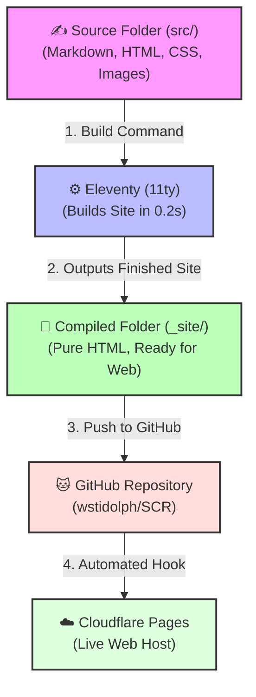

# Santa Cruz Randonneurs - Site Architecture & Maintenance Guide

Welcome to the Santa Cruz Randonneurs website! This guide is designed for **beginners** with no prior experience in coding, Git, or static site generators. It explains how the website works, how it builds, and provides clear, step-by-step instructions on how to make changes.

---

## 🗺️ How the Site Works (Architecture)

This website is a **Static Website**. Unlike systems like WordPress or Drupal, there is no database. Instead, the site consists of plain text files (HTML, CSS, Markdown) that are compiled together into a finished set of web pages, which are then hosted on a super-fast, free Cloudflare hosting account.

### Visual Deployment Workflow



---

## 📂 Folder Structures

Here are the important folders and files in your project directory:

```text
SCR_migrate/
├── src/                 <-- ✍️ YOUR WORKSPACE: Edit everything in here!
│   ├── _includes/
│   │   └── layout.njk   <-- The outer design template (header, navigation, footer).
│   ├── assets/
│   │   └── css/
│   │       └── index.css <-- The styling sheet (colors, fonts, animations).
│   ├── contact/
│   │   └── index.html   <-- Contact Form page.
│   ├── pages/           <-- Subpages (Rules, Routes, About Us, Results, etc.)
│   │   ├── rules.html
│   │   ├── routes.html
│   │   ├── paypal.html  <-- PayPal Registration Page.
│   │   └── ...
│   ├── sites/           <-- Preserved original Drupal PDFs and files.
│   ├── themes/          <-- Legacy styling assets.
│   ├── _redirects       <-- URL forwarding rules for Cloudflare.
│   └── index.html       <-- The Homepage (contains the 2026 Events board).
├── _site/               <-- 📁 THE COMPILED OUTPUT (Never edit files directly in here!).
├── eleventy.config.js   <-- Building compiler instructions.
├── package.json         <-- Node project settings.
└── maintenance_guide.md <-- You are here!
```

---

## 📝 Guide to Editing Pages

All pages are written using standard HTML/Markdown mixed text. At the top of every page file in `src/`, there is a metadata section block wrapped in triple dashes (`---`). This is called **Frontmatter**:

```yaml
---
layout: layout.njk
title: "Rules"
permalink: "/pages/rules/"
---
```
> [!IMPORTANT]
> Never delete or modify the `layout: layout.njk` or `permalink` values. Only edit the text in the `"title"` (inside quotes) or the content **below the second `---`**.

### 🌟 Writing Guide (Markdown & HTML Basics)

When editing text below the frontmatter block, you can use these simple syntax patterns:

| Formatting | Syntax Example | Finished Result |
| :--- | :--- | :--- |
| **Headers** | `## Sub-section Title` | Creates a medium sub-section heading |
| **Bold** | `**Bold Text**` | **Bold Text** |
| **Italics** | `*Italic Text*` | *Italic Text* |
| **Bullet Lists** | `- Item 1`<br>`- Item 2` | • Item 1<br>• Item 2 |
| **Links** | `[Visit RUSA](https://rusa.org)` | [Visit RUSA](https://rusa.org) |
| **Paragraphs** | Leave a blank line between blocks of text | Starts a new paragraph |

---

## 💻 Step-by-Step Maintenance Tasks

To manage your site, open your command terminal (PowerShell or Command Prompt) and navigate to the project directory:
```powershell
cd c:\Users\wayne\Dev\SCR_migrate
```

### Task 1: Preview Your Changes Locally
Before pushing changes live, you can preview the website on your computer:
1. Run the local preview server command:
   ```bash
   npm start
   ```
2. Open your web browser and go to: **`http://localhost:8080/`**
3. Open any file in `src/` (e.g. `src/index.html`), make a text edit, and save. The browser preview will refresh **automatically** in real-time!
4. Press `Ctrl + C` in the terminal to turn off the server when you are done.

### Task 2: Publish Your Changes to the Web (Git Deploy)
Once you are happy with your local previews, push them live to the internet:
1. Stage all changes:
   ```powershell
   git add .
   ```
2. Commit changes with a brief summary:
   ```powershell
   git commit -m "Update the 2026 events table"
   ```
3. Push to GitHub:
   ```powershell
   git push origin main
   ```
*That's it! Cloudflare will automatically detect your push, compile your website, and publish it to the web in under 10 seconds.*

---

## 🛠️ Handling Specific Common Tasks

### 1. Updating the Event Schedule
1. Open `src/index.html` in a text editor (like Notepad, VS Code, or Sublime Text).
2. Scroll down until you see the table markup starting with `<table class="table scr-events">`.
3. Each event row is wrapped in `<tr>` and `</tr>` tags. To add a new event, copy an existing `<tr>...</tr>` block and paste it below, then edit the values:
   ```html
   <tr>
     <th><strong>Saturday, March 7</strong></th>
     <th><a href="https://ridewithgps.com/routes/..."><strong>Event Name</strong></a></th>
     <th><strong>Carmel</strong></th>
     <th><strong>06:00</strong></th>
     <th><a href="/pages/registration/"><strong>$10</strong></a></th>
   </tr>
   ```
4. Save the file and follow **Task 2** to deploy!

### 2. Restoring Missing Event Images
We filed an issue to restore the missing Jenny Oh Hatfield photos on the **Ride Format** page:
1. Retrieve the original image files:
   - `Meeting.png`
   - `StoreControl.png`
2. Drop them directly into the folder: `src/sites/default/files/2021-04/`
3. Save, and run **Task 2** to deploy. The images will automatically load!

### 3. Activating the Contact Form Email Address
1. Go to [web3forms.com](https://web3forms.com/) and enter your club email to retrieve a free access key.
2. Open `src/contact/index.html` in a text editor.
3. Locate line 10 and replace `YOUR_ACCESS_KEY_HERE` with your key:
   ```html
   <input type="hidden" name="access_key" value="a1b2c3d4-e5f6-7a8b-9c0d-e1f2a3b4c5d6">
   ```
4. Save and deploy. Form submissions will now deliver straight to your inbox!
